### Documentation
> Hey y'all,  I'm Jovit Mathew, a first year Electronics and Computer Engineering Undergraduate from [**St.Joseph's College of Engineering and Technology, Palai**](https://sjcetpalai.ac.in/). I'm a beginner to the field of IoT. 

## Level 1:

> Level 1 aims to set the foundation to the field of electonics. It comprises of 12 Experiments which are beginner friendly.
### Experiment 1 - Hello World LED Blinking

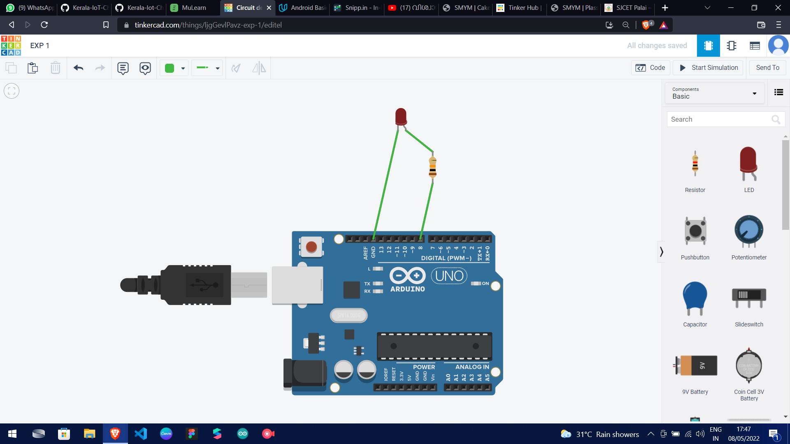

### Snapshots

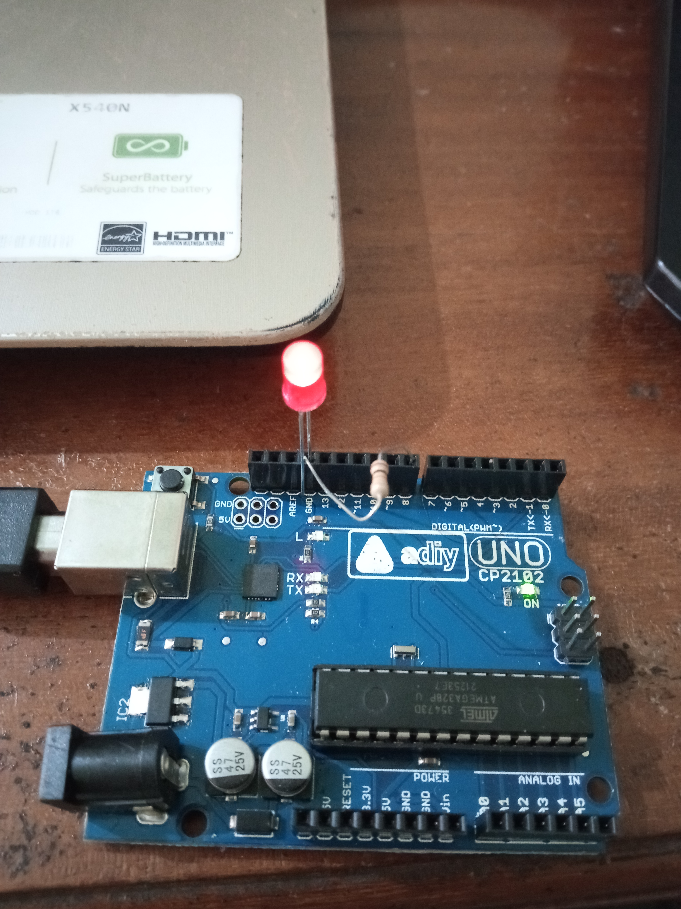
#### Code
```ino
int ledPin = 10; // define digital pin 10.
void setup()
{
pinMode(ledPin, OUTPUT);// define pin with LED connected as output.
}
void loop()
{
digitalWrite(ledPin, HIGH); // set the LED on.
delay(1000); // wait for a second.
digitalWrite(ledPin, LOW); // set the LED off.
delay(1000); // wait for a second
}
```

### Experiment 2 - Traffic Light

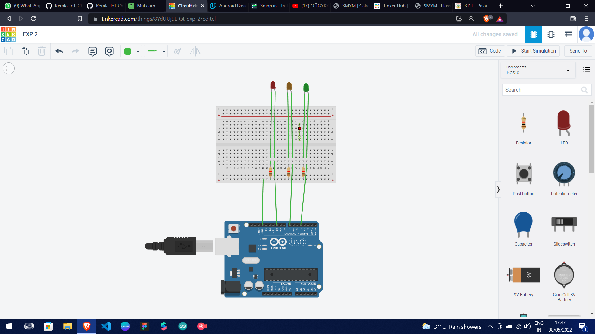

### Snapshots

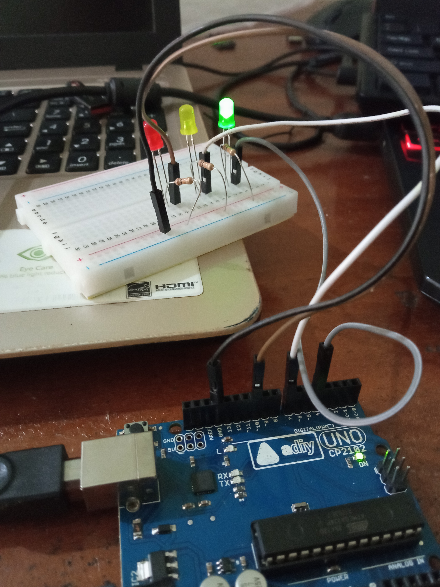
#### Code
```ino
int redled =10; // initialize digital pin 8.
int yellowled =7; // initialize digital pin 7.
int greenled =4; // initialize digital pin 4.
void setup()
{
pinMode(redled, OUTPUT);// set the pin with red LED as “output”
pinMode(yellowled, OUTPUT); // set the pin with yellow LED as “output”
pinMode(greenled, OUTPUT); // set the pin with green LED as “output”
}
void loop()
{
digitalWrite(greenled, HIGH);//// turn on green LED
delay(5000);// wait 5 seconds

digitalWrite(greenled, LOW); // turn off green LED
for(int i=0;i<3;i++)// blinks for 3 times
{
delay(500);// wait 0.5 second
digitalWrite(yellowled, HIGH);// turn on yellow LED
delay(500);// wait 0.5 second
digitalWrite(yellowled, LOW);// turn off yellow LED
} 
delay(500);// wait 0.5 second
digitalWrite(redled, HIGH);// turn on red LED
delay(5000);// wait 5 seconds
digitalWrite(redled, LOW);// turn off red LED
}
```

### Experiment 3 - LED Chasing Effect

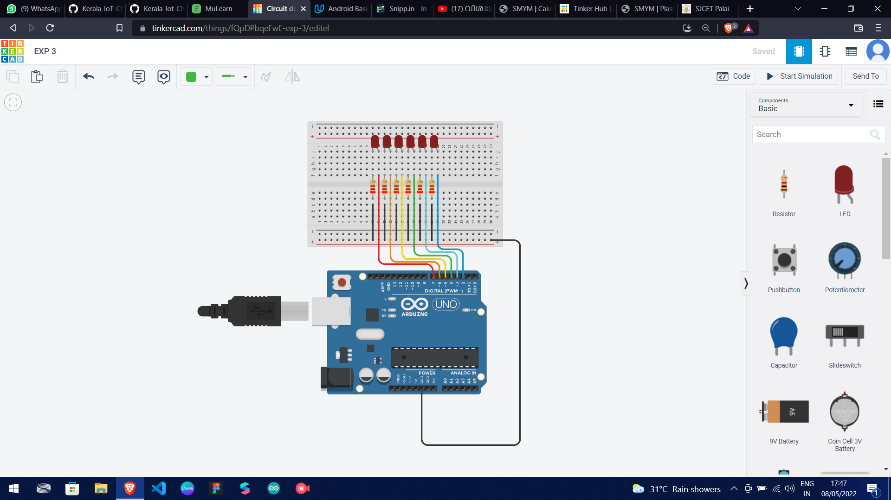

### Snapshots

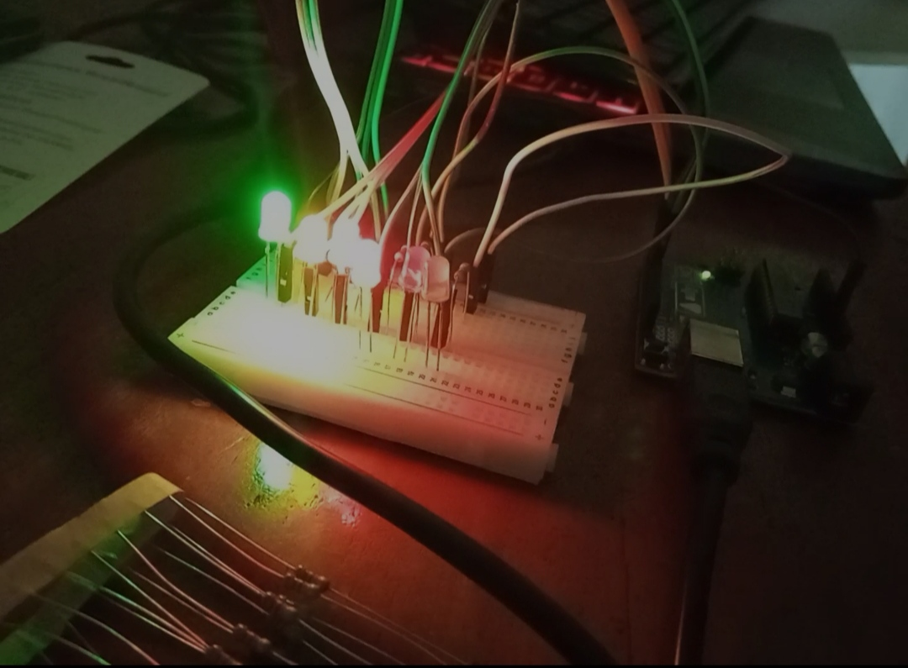
#### Code
```ino
int BASE = 2 ;  // the I/O pin for the first LED
int NUM = 6;   // number of LEDs
void setup()
{
   for (int i = BASE; i < BASE + NUM; i ++) 
   {
     pinMode(i, OUTPUT);   // set I/O pins as output
   }
}
void loop()
{
   for (int i = BASE; i < BASE + NUM; i ++) 
   {
     digitalWrite(i, LOW);    // set I/O pins as “low”, turn off LEDs one by one.
     delay(200);        // delay
   }
   for (int i = BASE; i < BASE + NUM; i ++) 
   {
     digitalWrite(i, HIGH);    // set I/O pins as “high”, turn on LEDs one by one
     delay(200);        // delay
   }  
}
```

### Experiment 4 - Button Controlled LED

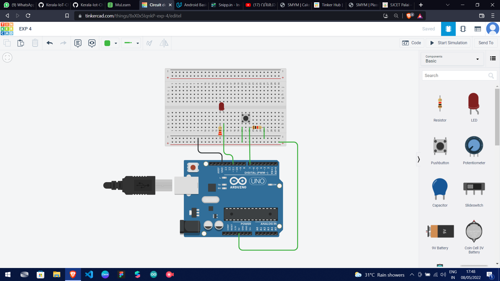

### Snapshots

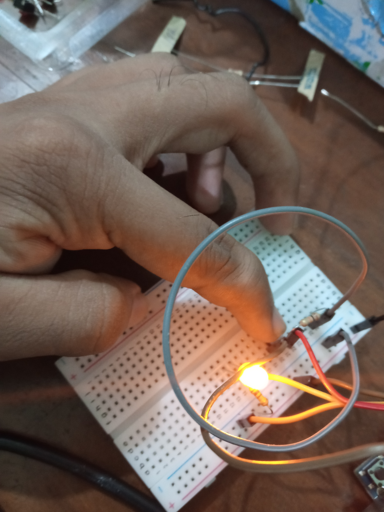
#### Code
```ino
int ledpin=11;// initialize pin 11
int inpin=7;// initialize pin 7
int val;// define val
void setup()
{
pinMode(ledpin,OUTPUT);// set LED pin as “output”
pinMode(inpin,INPUT);// set button pin as “input”
}
void loop()
{
val=digitalRead(inpin);// read the level value of pin 7 and assign if to val
if(val==LOW)// check if the button is pressed, if yes, turn on the LED
{ digitalWrite(ledpin,LOW);}
else
{ digitalWrite(ledpin,HIGH);}
}
```

### Experiment 5 - Buzzer

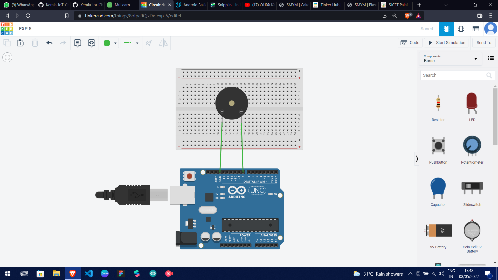

### Snapshots

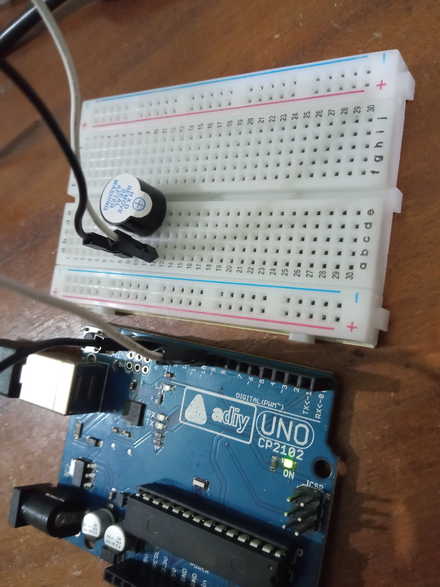
#### Code
```ino
int buzzer=8;// initialize digital IO pin that controls the buzzer
void setup() 
{ 
  pinMode(buzzer,OUTPUT);// set pin mode as “output”
} 
void loop() 
{
digitalWrite(buzzer, HIGH); // produce sound
}
```

### Experiment 6 - RGB LED

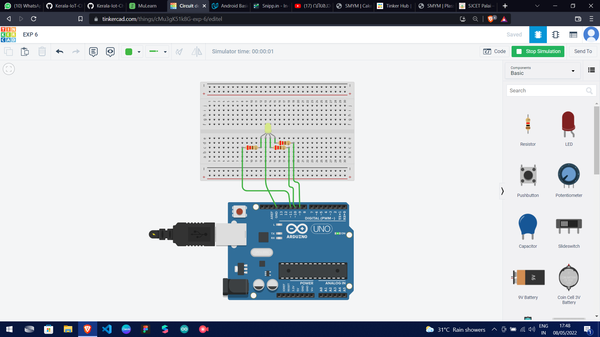

### Snapshots


#### Code
```ino
int redpin = 11; //select the pin for the red LED
int bluepin =10; // select the pin for the blue LED
int greenpin =9;// select the pin for the green LED
int val;
void setup() {
  pinMode(redpin, OUTPUT);
  pinMode(bluepin, OUTPUT);
  pinMode(greenpin, OUTPUT);
  Serial.begin(9600);
}
void loop() 
{
for(val=255; val>0; val--)
  {
   analogWrite(11, val);
   analogWrite(10, 255-val);
   analogWrite(9, 128-val);
   delay(1); 
  }
for(val=0; val<255; val++)
  {
   analogWrite(11, val);
   analogWrite(10, 255-val);
   analogWrite(9, 128-val);
   delay(1); 
  }
 Serial.println(val, DEC);
}
```

### Experiment 7 - LDR Light Sensor

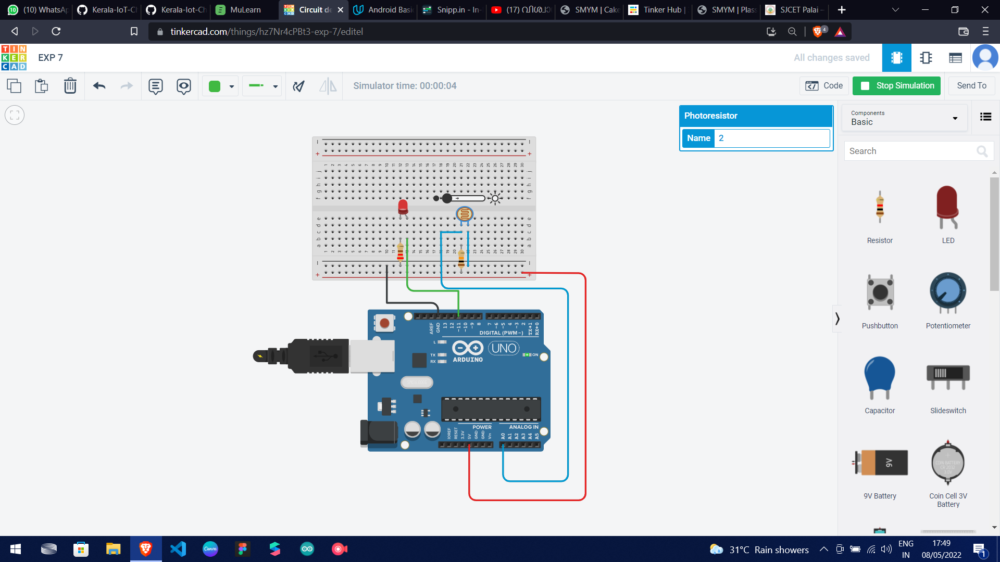

### Snapshots

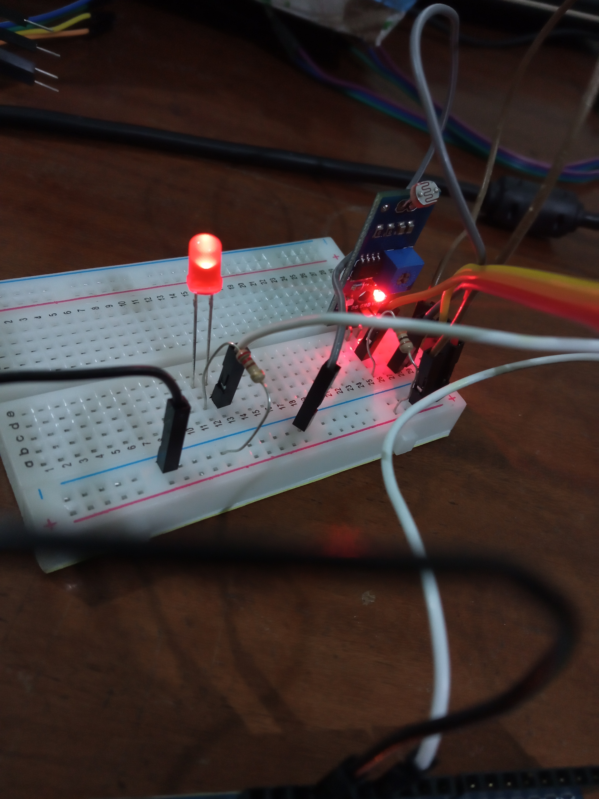
#### Code
```ino
int potpin=0;// initialize analog pin 0, connected with photovaristor
int ledpin=11;// initialize digital pin 11, 
int val=0;// initialize variable val
void setup()
{
pinMode(ledpin,OUTPUT);// set digital pin 11 as “output”
Serial.begin(9600);// set baud rate at “9600”
}
void loop()
{
val=analogRead(potpin);// read the value of the sensor and assign it to val
Serial.println(val);// display the value of val
analogWrite(ledpin,val/4);// set up brightness（maximum value 255）
delay(10);// wait for 0.01 
}
```


### Experiment 8 - Flame Sensor

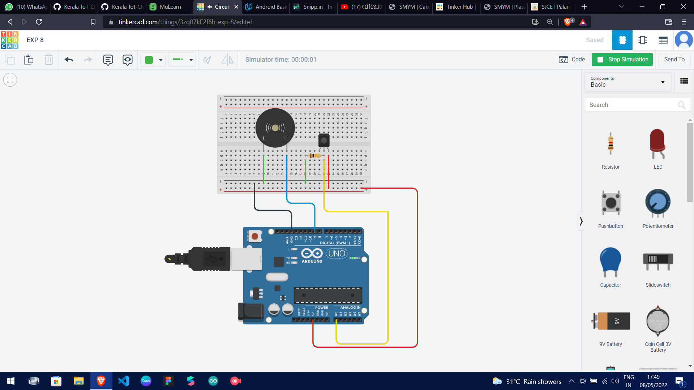

### Snapshots

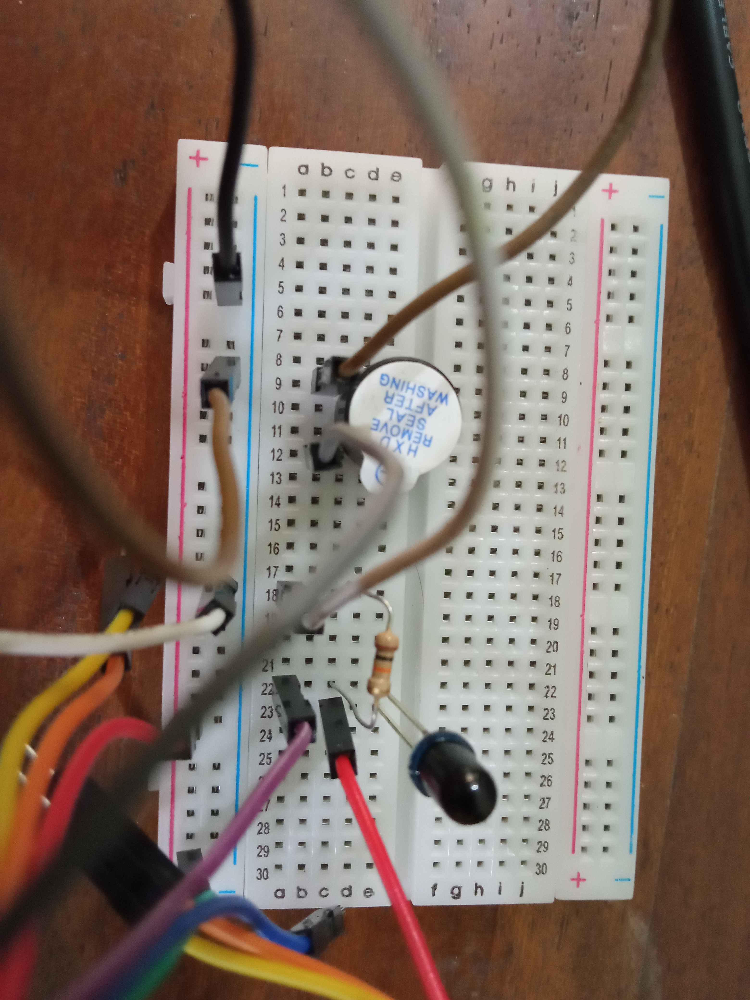
#### Code
```ino
int flame=0;// select analog pin 0 for the sensor
int Beep=9;// select digital pin 9 for the buzzer
int val=0;// initialize variable
 void setup() 
{
  pinMode(Beep,OUTPUT);// set LED pin as “output”
 pinMode(flame,INPUT);// set buzzer pin as “input”
 Serial.begin(9600);// set baud rate at “9600”
 } 
void loop() 
{ 
  val=analogRead(flame);// read the analog value of the sensor 
  Serial.println(val);// output and display the analog value
  if(val>=600)// when the analog value is larger than 600, the buzzer will buzz
  {  
   digitalWrite(Beep,HIGH); 
   }else 
   {  
     digitalWrite(Beep,LOW); 
    }
   delay(500); 
}
```

### Experiment 9 - LM35 Temperature Sensor

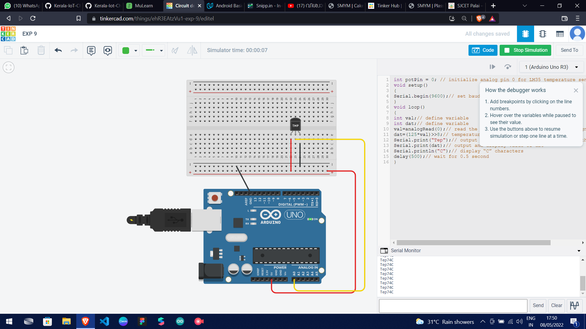

### Snapshots

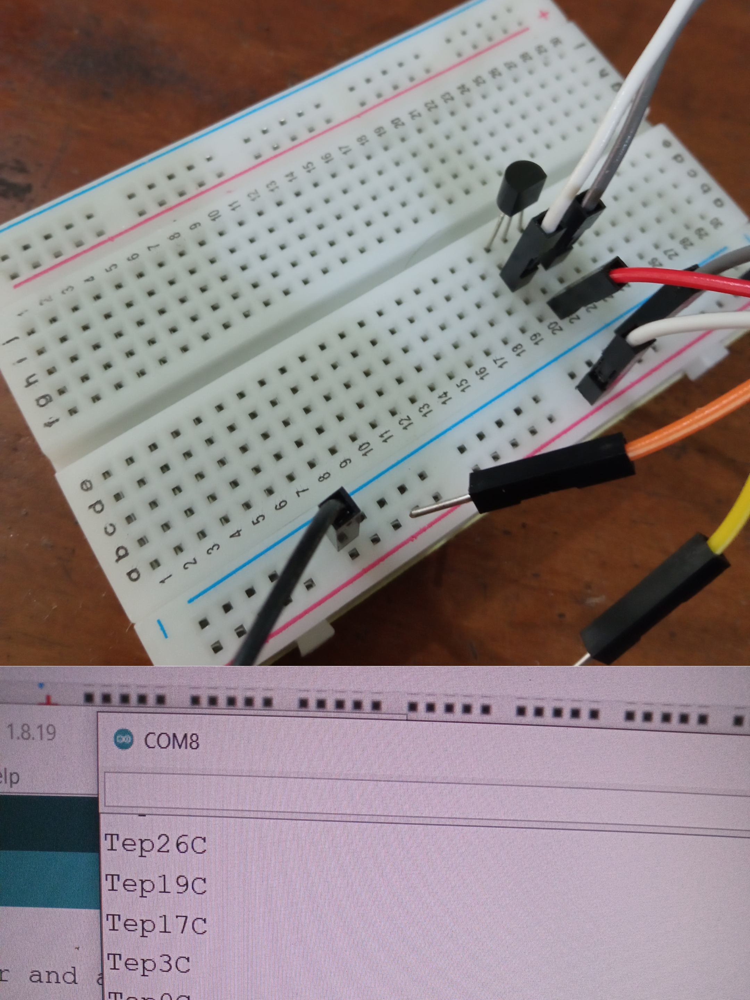
#### Code
```ino
int potPin = 0; // initialize analog pin 0 for LM35 temperature sensor
void setup()
{
Serial.begin(9600);// set baud rate at”9600”
}
void loop()
{
int val;// define variable
int dat;// define variable
val=analogRead(0);// read the analog value of the sensor and assign it to val
dat=(125*val)>>8;// temperature calculation formula
Serial.print("Tep");// output and display characters beginning with Tep
Serial.print(dat);// output and display value of dat
Serial.println("C");// display “C” characters
delay(500);// wait for 0.5 second
}
```

### Experiment 10 - IR Remote Control using TSOP

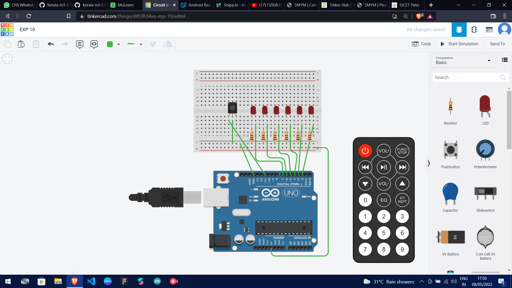

### Snapshots

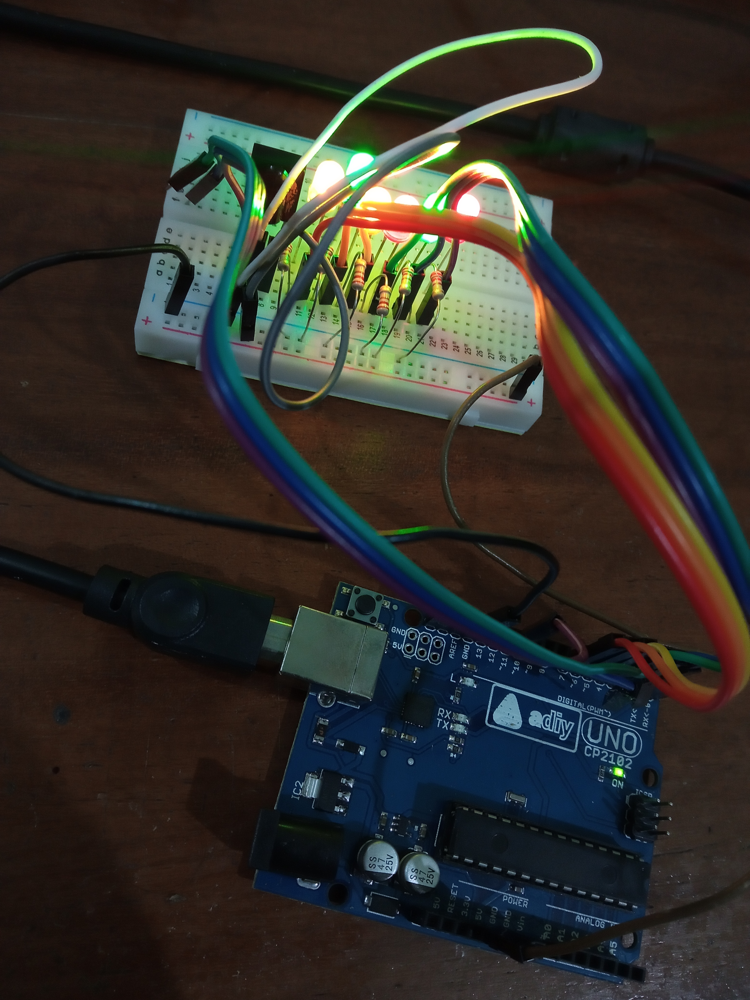
#### Code
```ino
#include <IRremote.h>
int RECV_PIN = 11;
int LED1 = 2;
int LED2 = 3;
int LED3 = 4;
int LED4 = 5;
int LED5 = 6;
int LED6 = 7;
long on1  = 0x00FF6897;
long off1 = 0x00FF9867;
long on2 = 0x00FFB04F;
long off2 = 0x00FF30CF;
long on3 = 0x00FF18E7;
long off3 = 0x00FF7A85;
long on4 = 0x00FF10EF;
long off4 = 0x00FF38C7;
long on5 = 0x00FF5AA5;
long off5 = 0x00FF42BD;
long on6 = 0x00FF4AB5;
long off6 = 0x00FF52AD;
IRrecv irrecv(RECV_PIN);
decode_results results;
// Dumps out the decode_results structure.
// Call this after IRrecv::decode()
// void * to work around compiler issue
//void dump(void *v) {
//  decode_results *results = (decode_results *)v
void dump(decode_results *results) {
  int count = results->rawlen;
  if (results->decode_type == UNKNOWN) 
    {
     Serial.println("Could not decode message");
    } 
  else 
   {
    if (results->decode_type == NEC) 
      {
       Serial.print("Decoded NEC: ");
      } 
    else if (results->decode_type == SONY) 
      {
       Serial.print("Decoded SONY: ");
      } 
    else if (results->decode_type == RC5) 
      {
       Serial.print("Decoded RC5: ");
      } 
    else if (results->decode_type == RC6) 
      {
       Serial.print("Decoded RC6: ");
      }
     Serial.print(results->value, HEX);
     Serial.print(" (");
     Serial.print(results->bits, DEC);
     Serial.println(" bits)");
   }
     Serial.print("Raw (");
     Serial.print(count, DEC);
     Serial.print("): ");
 for (int i = 0; i < count; i++) 
     {
      if ((i%2) == 1) {
      Serial.print(results->rawbuf[i]*USECPERTICK, DEC);
     } 
    else  
     {
      Serial.print(-(int)results->rawbuf[i]*USECPERTICK, DEC);
     }
    Serial.print(" ");
     }
      Serial.println("");
     }
void setup()
 {
  pinMode(RECV_PIN, INPUT);   
  pinMode(LED1, OUTPUT);
  pinMode(LED2, OUTPUT);
  pinMode(LED3, OUTPUT);
  pinMode(LED4, OUTPUT);
  pinMode(LED5, OUTPUT);
  pinMode(LED6, OUTPUT);  
  pinMode(13, OUTPUT);
  Serial.begin(9600);
   irrecv.enableIRIn(); // Start the receiver
 }
int on = 0;
unsigned long last = millis();
void loop() 
{
  if (irrecv.decode(&results)) 
   {
    // If it's been at least 1/4 second since the last
    // IR received, toggle the relay
    if (millis() - last > 250) 
      {
       on =!on;
//       digitalWrite(8, on? HIGH:LOW);
       digitalWrite(13, on? HIGH:LOW);
       dump(&results);
      }
    if (results.value == on1 )
       digitalWrite(LED1, HIGH);
    if (results.value == off1 )
       digitalWrite(LED1, LOW); 
    if (results.value == on2 )
       digitalWrite(LED2, HIGH);
    if (results.value == off2 )
       digitalWrite(LED2, LOW); 
    if (results.value == on3 )
       digitalWrite(LED3, HIGH);
    if (results.value == off3 )
       digitalWrite(LED3, LOW);
    if (results.value == on4 )
       digitalWrite(LED4, HIGH);
    if (results.value == off4 )
       digitalWrite(LED4, LOW); 
    if (results.value == on5 )
       digitalWrite(LED5, HIGH);
    if (results.value == off5 )
       digitalWrite(LED5, LOW); 
    if (results.value == on6 )
       digitalWrite(LED6, HIGH);
    if (results.value == off6 )
       digitalWrite(LED6, LOW);        
    last = millis();      
irrecv.resume(); // Receive the next value
  }
}
```

### Experiment 11 - Potentiometer analog Value Reading

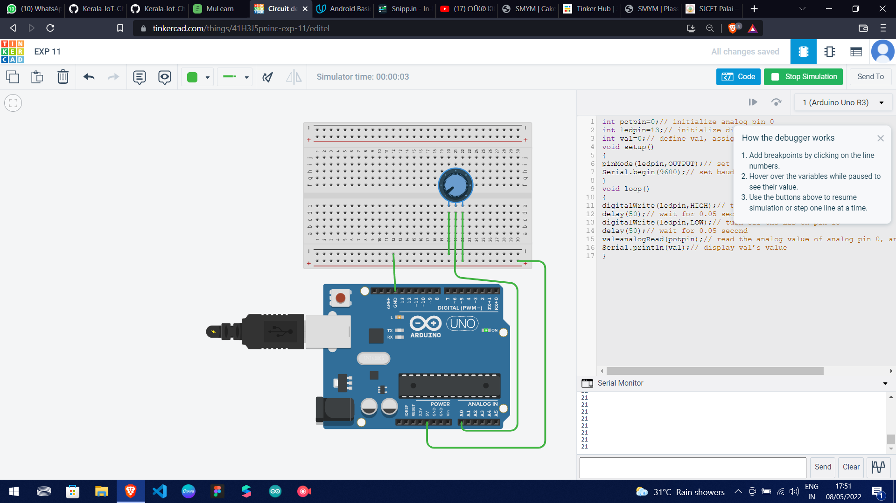

### Snapshots

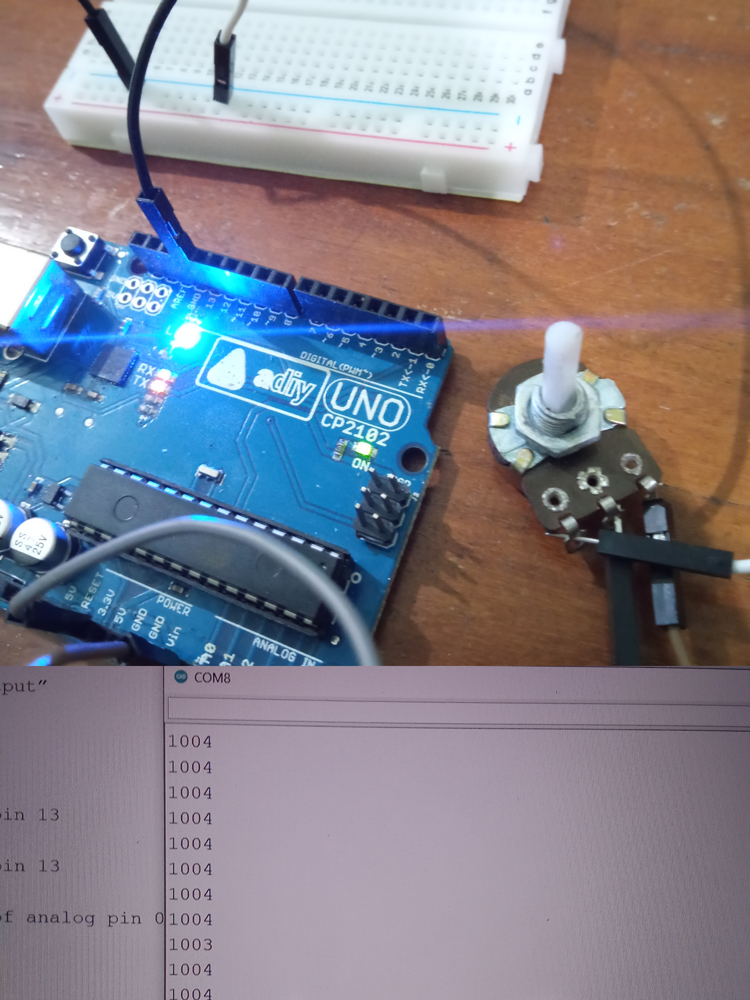
#### Code
```ino
int potpin=0;// initialize analog pin 0
int ledpin=13;// initialize digital pin 13
int val=0;// define val, assign initial value 0
void setup()
{
pinMode(ledpin,OUTPUT);// set digital pin as “output”
Serial.begin(9600);// set baud rate at 9600
}
void loop()
{
digitalWrite(ledpin,HIGH);// turn on the LED on pin 13
delay(50);// wait for 0.05 second
digitalWrite(ledpin,LOW);// turn off the LED on pin 13
delay(50);// wait for 0.05 second
val=analogRead(potpin);// read the analog value of analog pin 0, and assign it to val 
Serial.println(val);// display val’s value
}
```

### Experiment 12 - Segment Display

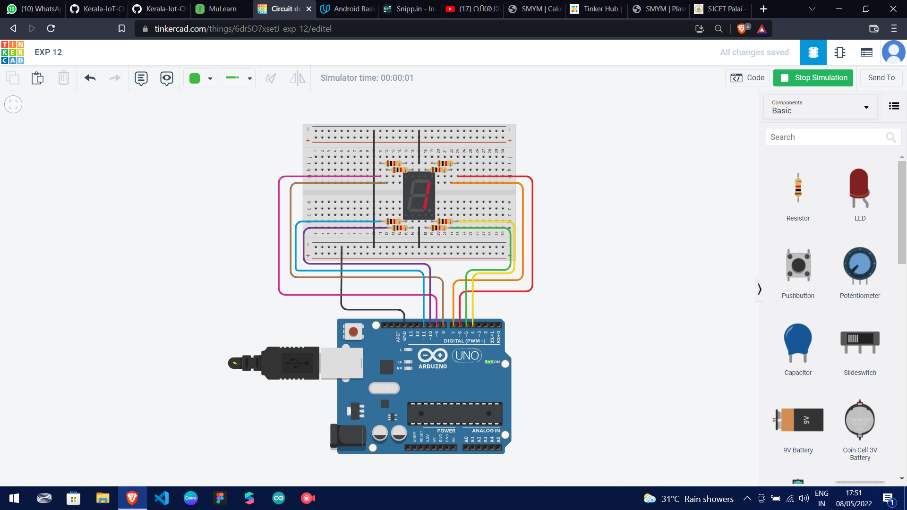
#### Code
```ino
int a=7;// set digital pin 7 for segment a
int b=6;// set digital pin 6 for segment b
int c=5;// set digital pin 5 for segment c
int d=10;// set digital pin 10 for segment d
int e=11;// set digital pin 11 for segment e
int f=8;// set digital pin 8 for segment f
int g=9;// set digital pin 9 for segment g
int dp=4;// set digital pin 4 for segment dp
void digital_0(void) // display number 5
{
unsigned char j;
digitalWrite(a,HIGH);
digitalWrite(b,HIGH);
digitalWrite(c,HIGH);
digitalWrite(d,HIGH);
digitalWrite(e,HIGH);
digitalWrite(f,HIGH);
digitalWrite(g,LOW);
digitalWrite(dp,LOW);
}
void digital_1(void) // display number 1
{
unsigned char j;
digitalWrite(c,HIGH);// set level as “high” for pin 5, turn on segment c
digitalWrite(b,HIGH);// turn on segment b
for(j=7;j<=11;j++)// turn off other segments
digitalWrite(j,LOW);
digitalWrite(dp,LOW);// turn off segment dp
}
void digital_2(void) // display number 2
{
unsigned char j;
digitalWrite(b,HIGH);
digitalWrite(a,HIGH);
for(j=9;j<=11;j++)
digitalWrite(j,HIGH);
digitalWrite(dp,LOW);
digitalWrite(c,LOW);
digitalWrite(f,LOW);
}
void digital_3(void) // display number 3
{digitalWrite(g,HIGH);
digitalWrite(a,HIGH);
digitalWrite(b,HIGH);
digitalWrite(c,HIGH);
digitalWrite(d,HIGH);
digitalWrite(dp,LOW);
digitalWrite(f,LOW);
digitalWrite(e,LOW);
}
void digital_4(void) // display number 4
{digitalWrite(c,HIGH);
digitalWrite(b,HIGH);
digitalWrite(f,HIGH);
digitalWrite(g,HIGH);
digitalWrite(dp,LOW);
digitalWrite(a,LOW);
digitalWrite(e,LOW);
digitalWrite(d,LOW);
}
void digital_5(void) // display number 5
{
unsigned char j;
digitalWrite(a,HIGH);
digitalWrite(b, LOW);
digitalWrite(c,HIGH);
digitalWrite(d,HIGH);
digitalWrite(e, LOW);
digitalWrite(f,HIGH);
digitalWrite(g,HIGH);
digitalWrite(dp,LOW);
}
void digital_6(void) // display number 6
{
unsigned char j;
for(j=7;j<=11;j++)
digitalWrite(j,HIGH);
digitalWrite(c,HIGH);
digitalWrite(dp,LOW);
digitalWrite(b,LOW);
}
void digital_7(void) // display number 7
{
unsigned char j;
for(j=5;j<=7;j++)
digitalWrite(j,HIGH);
digitalWrite(dp,LOW);
for(j=8;j<=11;j++)
digitalWrite(j,LOW);
}
void digital_8(void) // display number 8
{
unsigned char j;
for(j=5;j<=11;j++)
digitalWrite(j,HIGH);
digitalWrite(dp,LOW);
}
void digital_9(void) // display number 5
{
unsigned char j;
digitalWrite(a,HIGH);
digitalWrite(b,HIGH);
digitalWrite(c,HIGH);
digitalWrite(d,HIGH);
digitalWrite(e, LOW);
digitalWrite(f,HIGH);
digitalWrite(g,HIGH);
digitalWrite(dp,LOW);
}
void setup()
{
int i;// set variable
for(i=4;i<=11;i++)
pinMode(i,OUTPUT);// set pin 4-11as “output”
}
void loop()
{
while(1)
{
digital_0();// display number 0
delay(1000);// wait for 1s
digital_1();// display number 1
delay(1000);// wait for 1s
digital_2();// display number 2
delay(1000); // wait for 1s
digital_3();// display number 3
delay(1000); // wait for 1s
digital_4();// display number 4
delay(1000); // wait for 1s
digital_5();// display number 5
delay(1000); // wait for 1s
digital_6();// display number 6
delay(1000); // wait for 1s
digital_7();// display number 7
delay(1000); // wait for 1s
digital_8();// display number 8
delay(1000); // wait for 1s
digital_9();// display number 9
delay(1000); // wait for 1s
}}
```

## IoT Challenge Assignments

### **Assignment 1** - Automatic Night Lamp using LDR & LED

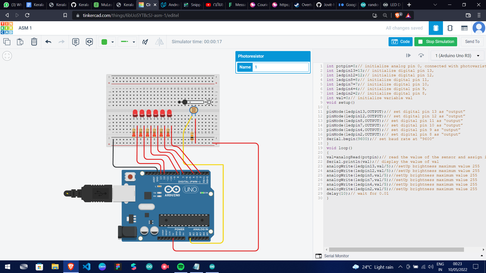
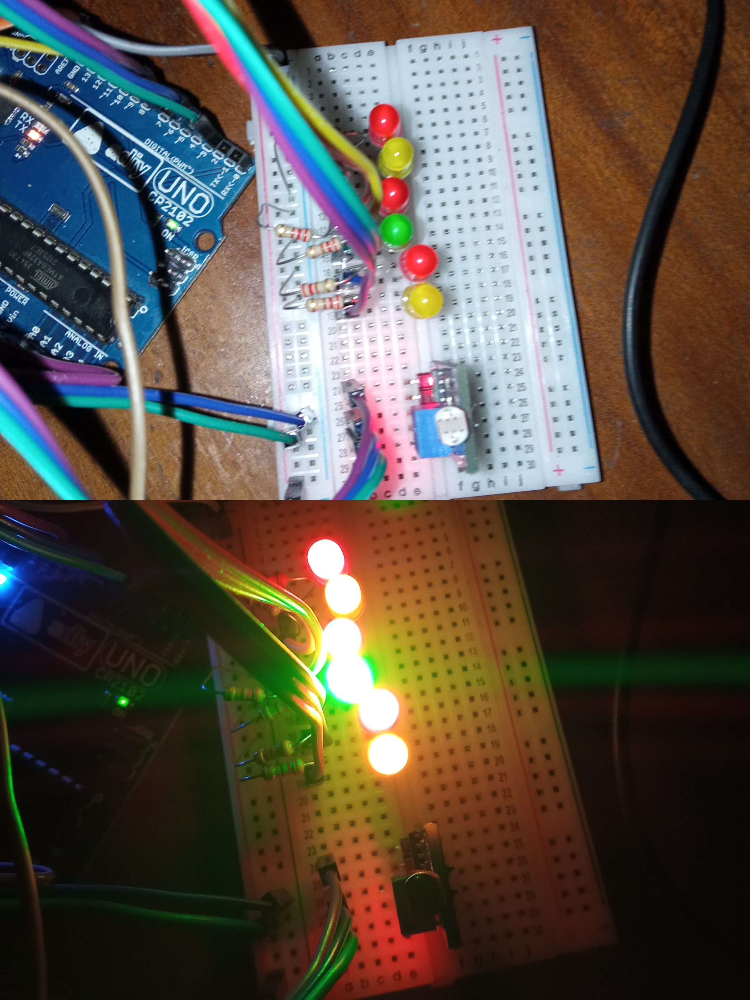
#### Code
```ino
int potpin=0;// initialize analog pin 0, connected with photovaristor
int ledpin13=13;// initialize digital pin 13, 
int ledpin12=12;// initialize digital pin 12,
int ledpin8=8;// initialize digital pin 11,
int ledpin7=7;// initialize digital pin 10,
int ledpin4=4;// initialize digital pin 9,
int ledpin2=2;// initialize digital pin 8,
int val=0;// initialize variable val
void setup()
{
pinMode(ledpin13,OUTPUT);// set digital pin 13 as “output”
pinMode(ledpin12,OUTPUT);// set digital pin 12 as “output”
pinMode(ledpin8,OUTPUT);// set digital pin 11 as “output”
pinMode(ledpin7,OUTPUT);// set digital pin 10 as “output”
pinMode(ledpin4,OUTPUT);// set digital pin 9 as “output”
pinMode(ledpin2,OUTPUT);// set digital pin 8 as “output”
Serial.begin(9600);// set baud rate at “9600”
}
void loop()
{
val=analogRead(potpin);// read the value of the sensor and assign it to val
Serial.println(val);// display the value of val
analogWrite(ledpin13,val/5);//setUp brightness maximum value 255
analogWrite(ledpin12,val/5);//setUp brightness maximum value 255
analogWrite(ledpin8,val/5);//setUp brightness maximum value 255
analogWrite(ledpin7,val/5);//setUp brightness maximum value 255
analogWrite(ledpin4,val/5);//setUp brightness maximum value 255
analogWrite(ledpin2,val/5);//setUp brightness maximum value 255  
delay(10);// wait for 0.01 
}
```

## Simulation Video

<iframe src="https://drive.google.com/file/d/0B6m34D8cFdpMZndKTlBRU0tmczg/preview" frameborder="0" allowfullscreen="true"> </iframe>


### **Assignment 2** - Digital Dice using 6 LEDs & 1 Push Button

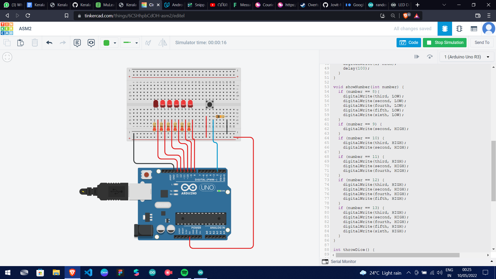
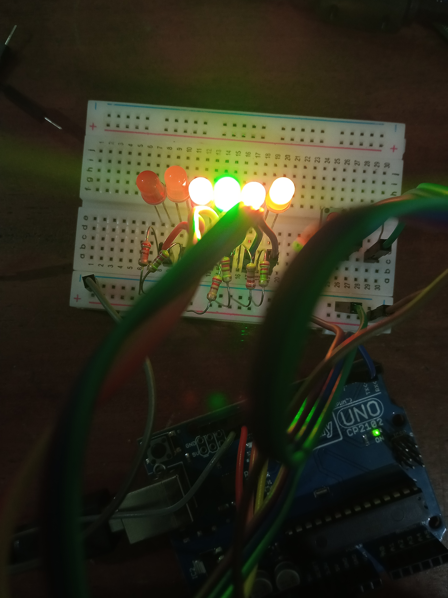
#### Code
```ino

// 6 consecutive digital pins for the LEDs
int first = 8;
int second = 9;
int third = 10;
int fourth = 11;
int fifth = 12;
int sixth = 13;

// pin for the button switch
int button = 2;
// value to check state of button switch
int pressed = 0;

void setup() {
  // set all LED pins to OUTPUT
  for (int i=first; i<=sixth; i++) {
    pinMode(i, OUTPUT);
  }
  // set buttin pin to INPUT
  pinMode(button, INPUT);
  
  // initialize random seed by noise from analog pin 0 (should be unconnected)
  randomSeed(analogRead(0));

  // if we're debugging, connect to serial 
  #ifdef DEBUG
    Serial.begin(9600);
  #endif

}

void buildUpTension() {
  // light LEDs from left to right and back to build up tension
  // while waiting for the dice to be thrown
  // left to right
  for (int i=first; i<=sixth; i++) {
    if (i!=first) {
      digitalWrite(i-1, LOW);
    }
    digitalWrite(i, HIGH);
    delay(100);
  }
  // right to left
  for (int i=sixth; i>=first; i--) {
    if (i!=sixth) {
      digitalWrite(i+1, LOW);
    }
    digitalWrite(i, HIGH);
    delay(100);
  }
}

void showNumber(int number) {
  if (number == 8){
    digitalWrite(third, LOW);
    digitalWrite(second, LOW);
    digitalWrite(fourth, LOW);
    digitalWrite(fifth, LOW); 
    digitalWrite(sixth, LOW); 
  }
  if (number == 9) {
    digitalWrite(second, HIGH);
  }
  if (number == 10) {
    digitalWrite(third, HIGH);
    digitalWrite(second, HIGH); 
  }
  if (number == 11) {
    digitalWrite(third, HIGH);
    digitalWrite(second, HIGH);
    digitalWrite(fourth, HIGH);    
  }
  if (number == 12) {
    digitalWrite(third, HIGH);
    digitalWrite(second, HIGH);
    digitalWrite(fourth, HIGH);
    digitalWrite(fifth, HIGH);    
  }
  if (number == 13) {
    digitalWrite(third, HIGH);
    digitalWrite(second, HIGH);
    digitalWrite(fourth, HIGH);
    digitalWrite(fifth, HIGH); 
    digitalWrite(sixth, HIGH);    
  }
}

int throwDice() {
  // get a random number in the range [1,6]
  int randNumber = random(7,14);
  
  #ifdef DEBUG
    Serial.println(randNumber);
  #endif
  
  return randNumber;
}

void setAllLEDs(int value) {
  for (int i=first; i<=sixth; i++) {
    digitalWrite(i, value);
  }
}

void loop() {
  // if button is pressed - throw the dice
  pressed = digitalRead(button);

  if (pressed == HIGH) {
    // remove previous number
    setAllLEDs(LOW);
    
    buildUpTension();
    int thrownNumber = throwDice();
    showNumber(thrownNumber);
  } 

}
```
## Simulation Video

<iframe src="https://drive.google.com/file/d/0B6m34D8cFdpMZndKTlBRU0tmczg/preview" frameborder="0" allowfullscreen="true"> </iframe>
